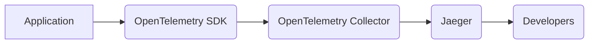

# Distributed Tracing with Jaeger and OpenTelemetry

This document explains how to use Jaeger and OpenTelemetry for implementing distributed tracing in the application.

## What is Distributed Tracing?

Distributed tracing is a technique used to track requests as they propagate through a distributed system. It allows developers to visualize the flow of requests, identify bottlenecks, and troubleshoot performance issues.

## Key Components

*   **Jaeger:** An open-source distributed tracing system used for collecting, storing, and visualizing traces.
*   **OpenTelemetry:** A vendor-neutral, open-source observability framework for generating, collecting, and exporting telemetry data (metrics, logs, and traces).

## Data Flow

The following diagram illustrates the flow of data through the distributed tracing system:



## Implementing Distributed Tracing

1.  **Instrument your application:** Use the OpenTelemetry SDK to instrument your application code. This involves adding code to create spans that represent the start and end of operations.
2.  **Configure the OpenTelemetry Collector:** Configure the OpenTelemetry Collector to receive traces from your application and export them to Jaeger.
3.  **Deploy Jaeger:** Deploy Jaeger to collect, store, and visualize the traces.

## Code Example (Python)

```python
from opentelemetry import trace
from opentelemetry.sdk.trace import TracerProvider
from opentelemetry.sdk.trace.export import BatchSpanProcessor
from opentelemetry.exporter.jaeger.thrift import JaegerExporter

# Configure Jaeger exporter
jaeger_exporter = JaegerExporter(
    collector_endpoint="http://localhost:14268/api/traces",
    service_name="my-application"
)

# Configure span processor
span_processor = BatchSpanProcessor(jaeger_exporter)

# Configure tracer provider
tracer_provider = TracerProvider()
tracer_provider.add_span_processor(span_processor)
trace.set_tracer_provider(tracer_provider)

# Get tracer
tracer = trace.get_tracer(__name__)

# Create a span
with tracer.start_as_current_span("my-operation"):
    # Do something
    pass
```

## Troubleshooting Common Issues

*   **Traces are not being collected:** Check the OpenTelemetry Collector configuration for errors. Verify that the collector is running and that your application is able to connect to the collector.
*   **Traces are not being displayed in Jaeger:** Check the Jaeger configuration for errors. Verify that Jaeger is running and that the collector is able to export traces to Jaeger.
*   **Spans are not being created:** Check your application code for errors. Verify that you have correctly instrumented your code with the OpenTelemetry SDK.

## Further Documentation

*   [Jaeger Documentation](https://www.jaegertracing.io/docs/)
*   [OpenTelemetry Documentation](https://opentelemetry.io/docs/)