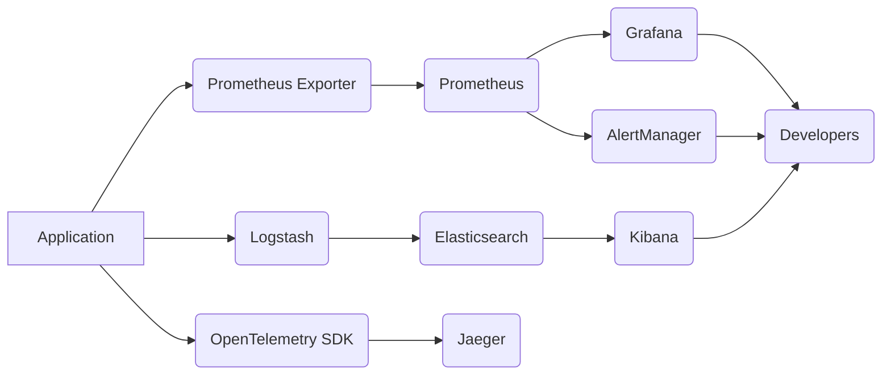

# Observability Overview

This document provides a comprehensive overview of the observability setup for the application. It is intended for developers of all skill levels and aims to explain the flow of data, the tools used, and how to troubleshoot common issues.

## Key Components

The observability stack consists of the following key components:

*   **Metrics:** Prometheus collects system and application metrics, providing insights into resource utilization, performance, and overall health.
*   **Logs:** Elasticsearch, Logstash, and Kibana (ELK stack) are used to collect, process, and visualize logs from various services.
*   **Tracing:** Jaeger and OpenTelemetry are used to implement distributed tracing, allowing developers to track requests as they propagate through the system.
*   **APM:** APM Server provides application performance monitoring, offering insights into application performance and identifying bottlenecks.
*   **Alerting:** AlertManager is used to configure alerts based on metrics and logs, notifying developers of critical issues.

## Data Flow

The following diagram illustrates the flow of data through the observability stack:

## Troubleshooting Common Issues

This section provides guidance on troubleshooting common issues related to the observability stack.

### High CPU Usage

*   Check Prometheus for metrics related to CPU usage.
*   Use Grafana to visualize CPU usage over time.
*   Identify the services or processes that are consuming the most CPU.
*   Analyze logs in Kibana for potential causes of high CPU usage.

### Service Unavailable

*   Check AlertManager for alerts related to service unavailability.
*   Use Grafana to visualize service health and availability.
*   Analyze logs in Kibana for errors or exceptions that may be causing the service to be unavailable.
*   Use Jaeger to trace requests and identify bottlenecks.

### Slow Response Times

*   Use APM Server to identify slow-running transactions.
*   Use Jaeger to trace requests and identify bottlenecks.
*   Check Prometheus for metrics related to response times.
*   Analyze logs in Kibana for errors or exceptions that may be contributing to slow response times.

## Further Documentation

*   [Prometheus Documentation](https://prometheus.io/docs/)
*   [Grafana Documentation](https://grafana.com/docs/)
*   [Elasticsearch Documentation](https://www.elastic.co/guide/en/elasticsearch/reference/current/index.html)
*   [Kibana Documentation](https://www.elastic.co/guide/en/kibana/current/index.html)
*   [Jaeger Documentation](https://www.jaegertracing.io/docs/)
*   [OpenTelemetry Documentation](https://opentelemetry.io/docs/)
*   [APM Server Documentation](https://www.elastic.co/guide/en/apm/server/current/index.html)
*   [AlertManager Documentation](https://prometheus.io/docs/alerting/latest/alertmanager/)