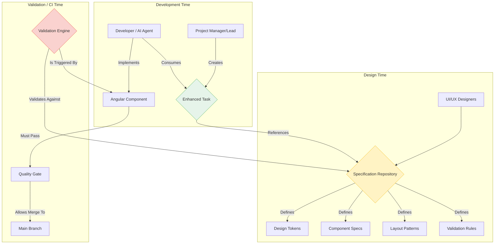
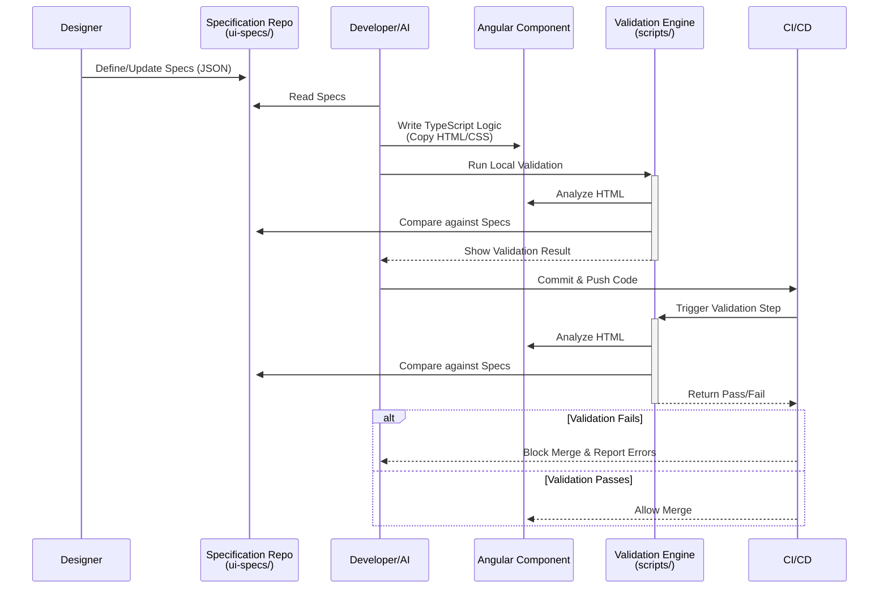

# UI Control System: Detailed System Design

## 1. Overview

This document provides the detailed technical design for the UI Control System. It expands on the `UI_System_Architecture.md` and provides implementation details for the core components of the system: the Specification Repository, the Validation Engine, and the Developer Workflow.

The primary goal is to create a machine-driven process that ensures all UI components are built to exact specifications, eliminating design deviation and enabling rapid, consistent development.

## 2. System Components

The system consists of three main components that work in concert.

### 2.1. Specification Repository (`ui-specs/`)

This is the immutable source of truth for the entire design system.

-   **`design-system/design-tokens.json`**:
    -   **Schema**: Must follow a strict, versioned schema. See `complete_ui_control_solution.md` for the baseline structure.
    -   **Consumption**:
        -   A script (`scripts/ingest-tokens.js`) will transform this JSON into SCSS variables (e.g., `_design-tokens.scss`) to be imported into the Angular application's global style file.
        -   The Validation Engine will read this file directly to validate token usage.
-   **`components/{component-family}-spec.json`**:
    -   **Granularity**: Each file will contain specifications for a family of components (e.g., `auth-components-spec.json`, `dashboard-components-spec.json`).
    -   **`required_structure`**: This is the core of the component spec. It's a tree-like structure representing the exact DOM hierarchy. Each node must define the `element`, `classes`, and `children`.
    -   **`validation_rules`**: Defines form validation logic (e.g., `required`, `minLength`).
-   **`validation/validation-rules.json`**:
    -   **Purpose**: Defines global rules that are not component-specific.
    -   **Content**: Includes forbidden element types (`table`, `inline styles`), forbidden class patterns (`custom-*`), and required class combinations (`input` + `focus` classes).

### 2.2. The Validation Engine

This is a set of scripts responsible for enforcing compliance. It will be run as a pre-commit hook and as a required step in the CI pipeline.

-   **Location**: `scripts/validate-ui.js` (main script), with helpers for each validation type.
-   **Core Technologies**: Node.js, with libraries like `cheerio` for DOM parsing and `ajv` for JSON schema validation.
-   **Workflow**:
    1.  The script accepts a path to a component's HTML file as an argument.
    2.  It identifies the component's specification file from the `ui-specs` directory.
    3.  **HTML Structure Validation**:
        -   It loads the component's HTML into `cheerio`.
        -   It traverses the `required_structure` tree from the spec.
        -   For each element in the spec, it constructs a selector (e.g., `div.auth-card`) and verifies its existence and parent-child relationships in the actual HTML.
        -   Any mismatch (missing element, wrong parent) results in a validation error.
    4.  **CSS Class Validation**:
        -   For each element found, it compares the classes in the HTML with the `classes` array in the spec.
        -   It ensures all required classes are present.
        -   It checks for any classes that are *not* in the spec or the global `design-tokens.json` (ingested as an allow-list). Any unknown class is an error.
    5.  **Output**: The script will output a JSON report detailing the validation results. A non-zero error count will cause the script to exit with a failure code, failing the CI step or commit.

### 2.3. The Generation & Developer Workflow

This component focuses on streamlining the developer experience.

-   **Task Creation**:
    -   A project manager or lead copies the `enhanced-ui-task-template.json`.
    -   They fill in the details, crucially pointing to the correct component specification file.
    -   This task is assigned to a developer or an AI agent.
-   **Component Scaffolding (Optional but Recommended)**:
    -   A script, `scripts/generate-component.js`, can be created.
    -   **Function**: It would read a component spec and generate the basic `.ts`, `.html`, and `.scss` files, pre-populated with the exact HTML structure and placeholder TypeScript logic.
    -   **Benefit**: This reduces boilerplate and ensures the developer starts from a compliant foundation.
-   **Development Process**:
    1.  Developer receives the task with a link to the spec.
    2.  They create/scaffold the component files.
    3.  **HTML is a no-touch zone.** The structure is copied verbatim from the spec.
    4.  **SCSS is a no-touch zone.** No custom styles are written. The file exists only to scope the component.
    5.  **TypeScript is the creative zone.** The developer implements all business logic, form handling, and service integrations within the `.ts` file.
-   **Local Validation**: Before committing, the developer runs `npm run validate:ui -- --component=src/app/components/auth/login`. This provides immediate feedback.

## 3. Data Flow Diagram

## 4. Implementation Plan Summary

This design will be realized by executing the remaining phases of the project plan:

-   **Phase 2: Process & Workflow Definition**: Create the documentation and script specifications based on the design detailed in this document.
-   **Phase 3: Task & Governance Documentation**: Create the user-facing templates and guides that will be used in the day-to-day workflow.

This system design provides a complete blueprint for building a robust, automated, and scalable UI development process.