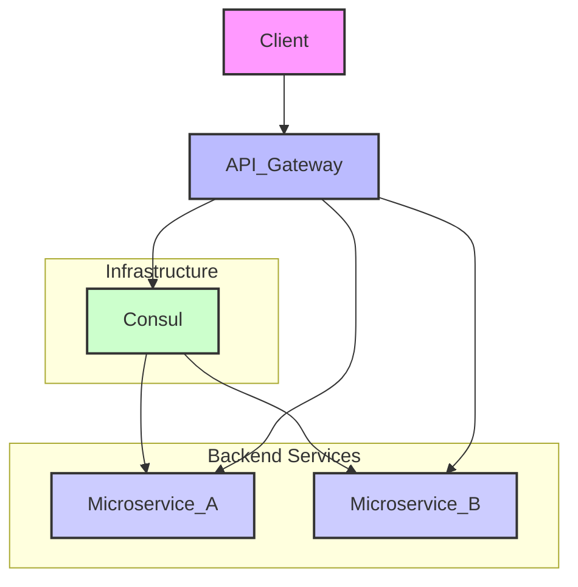

# API Gateway Architecture & Rationale

## Overview

This document outlines the architecture and rationale behind implementing an API Gateway, specifically using Ocelot and Consul, within our microservices ecosystem. The API Gateway acts as a single entry point for all client requests, abstracting the underlying microservices and providing centralized handling of cross-cutting concerns.

## Why an API Gateway?

In a microservices architecture, clients often need to interact with multiple backend services to perform a single business operation. Without an API Gateway, clients would need to know the addresses of all individual services, manage load balancing, and handle concerns like authentication and rate limiting for each service independently. This leads to increased complexity on the client side and duplicates effort across multiple frontend applications.

An API Gateway addresses these challenges by:

*   **Single Entry Point:** Providing a unified API endpoint for clients, simplifying client-side development.
*   **Request Routing:** Intelligently routing requests to the appropriate backend microservice.
*   **Cross-Cutting Concerns:** Centralizing authentication, authorization, rate limiting, caching, and logging.
*   **Protocol Translation:** Enabling communication between different protocols (e.g., REST to gRPC).
*   **Service Decomposition:** Hiding the complexity of the internal microservices architecture from clients.

## Choice of Technologies: Ocelot & Consul

### Ocelot (API Gateway)

Ocelot is a lightweight, fast, and scalable API Gateway built specifically for .NET Core applications. Its key advantages for this project include:

*   **Native .NET Integration:** Seamless integration with the existing .NET Core backend services.
*   **Configuration-Driven:** Easily configurable with JSON files, making it simple to define routing rules and policies.
*   **Extensible:** Supports custom middleware, allowing for tailored logic for authentication, logging, and other concerns.
*   **Performance:** Designed for high performance, crucial for an API Gateway that handles all incoming traffic.

### Consul (Service Discovery)

Consul is a distributed service mesh providing service discovery, health checking, and a K/V store. It complements Ocelot by:

*   **Dynamic Service Discovery:** Microservices automatically register themselves with Consul, and Ocelot can dynamically discover their locations without hardcoding IP addresses or ports.
*   **Health Checking:** Consul performs health checks on registered services, allowing Ocelot to route requests only to healthy instances, improving system reliability.
*   **Centralized Configuration:** Can be used to store dynamic Ocelot configurations or other shared settings.

## Architectural Diagram

## Benefits for Frontend Access

*   **Simplified Configuration:** Frontend applications only need to know the API Gateway's URL, not the individual URLs of each microservice.
*   **Consistent API Surface:** The Gateway can present a unified and consistent API to the frontend, even if the underlying microservices have different API designs or versions.
*   **Reduced Network Calls:** The Gateway can aggregate multiple backend service calls into a single response to the client, reducing network latency and improving performance.
*   **Security:** Centralized authentication and authorization protect backend services, simplifying security implementation on the frontend.

## Benefits for Backend Management

*   **Dynamic Routing:** Services can be scaled up or down, or moved, without requiring changes to the Gateway configuration or client applications, thanks to Consul's service discovery.
*   **Improved Resilience:** Health checks and intelligent routing ensure that requests are only sent to healthy service instances, improving the overall fault tolerance of the system.
*   **Centralized Policy Enforcement:** Security, rate limiting, and other policies are applied consistently across all services at the Gateway level.
*   **Easier Refactoring:** Microservices can be refactored or replaced without affecting clients, as long as the API contract exposed by the Gateway remains consistent.

This architecture provides a robust and scalable solution for managing API access in a microservices environment, benefiting both frontend developers and backend operations.