# UI Development Workflow: A Specification-Driven Process

## 1. Introduction

This document defines the end-to-end workflow for creating UI components under the new UI Control System. This process is designed to be rigorous, repeatable, and automation-heavy to ensure that all development output strictly adheres to the central design specifications. It applies to both human developers and AI agents.

## 2. The Workflow Stages

The workflow is divided into four distinct stages: Task Definition, Development, Validation, and Integration.

```mermaid
graph TD
    subgraph "1. Task Definition"
        A[PM/Lead Creates Task] --> B{Fills Enhanced Task Template};
        B --> C[Links to Component & Layout Specs];
        C --> D[Assigns Task];
    end

    subgraph "2. Development"
        E[Developer/AI Receives Task] --> F{Scaffolds Component Files};
        F --> G[Copies HTML Structure & CSS Classes];
        G --> H[Implements TypeScript Logic];
    end

    subgraph "3. Validation"
        I[Developer/AI Runs Local Validation] --> J{Fixes Errors};
        J -- Iterates Until Pass --> I;
        J -- On Pass --> K[Commits Code];
    end

    subgraph "4. Integration (CI/CD)"
        L[CI Pipeline Triggers] --> M{Runs Automated Validation Engine};
        M -- "FAIL" --> N[Blocks Merge & Notifies Developer];
        M -- "PASS" --> O[Merges to Main Branch];
    end

    style B fill:#E6F4EA,stroke:#34A853
    style H fill:#D1E3FF,stroke:#4285F4
    style I fill:#FAD2CF,stroke:#EA4335
    style M fill:#FAD2CF,stroke:#EA4335
    style O fill:#CEEAD6,stroke:#34A853
```

## 3. Stage-by-Stage Breakdown

### Stage 1: Task Definition

-   **Actor**: Project Manager or Team Lead
-   **Trigger**: A new UI component is required as part of a feature.
-   **Steps**:
    1.  **Locate/Create Specifications**: Ensure that the necessary component, layout, and token specifications exist in the `ui-specs/` repository. If not, they must be created by the design team first.
    2.  **Create Enhanced Task**: Copy the `ui-specs/templates/enhanced-ui-task-template.json` to create a new task file or ticket.
    3.  **Populate the Task**:
        -   Fill in the `title` and `description`.
        -   Set the `ui_control_specifications` by providing the correct paths to the `component_library_reference`, `layout_pattern`, and `design_tokens_file`.
        -   Define the `components_to_create`, specifying the exact `name` and `specification_reference` (e.g., `auth-components-spec.json#LoginComponent`).
    4.  **Assign Task**: Assign the task to a developer or AI agent. The task itself contains all the information needed for implementation.

### Stage 2: Development

-   **Actor**: Developer or AI Agent
-   **Trigger**: A new task is assigned.
-   **Steps**:
    1.  **Parse the Task**: Read the enhanced task JSON to understand all constraints and specification paths.
    2.  **Scaffold Files**: Create the necessary component files (e.g., `login.component.ts`, `login.component.html`, `login.component.scss`) in the `frontend/src/app/components/` directory. The optional `generate-component.js` script can automate this.
    3.  **Copy HTML (The "Golden Rule")**: Open the referenced component specification file (e.g., `auth-components-spec.json`). Copy the entire `required_structure` into the `.html` file. **NO MODIFICATIONS ARE ALLOWED.**
    4.  **Implement Logic**: Open the `.ts` file. Implement all required business logic, including:
        -   Setting up `FormGroup`s and `FormControl`s from `@angular/forms`.
        -   Implementing the validation rules defined in the spec (`Validators.required`, `Validators.minLength`, etc.).
        -   Creating event handlers (`onSubmit()`, `onClick()`, etc.).
        -   Integrating with services for data fetching or submission.
    5.  **No Custom Styling**: The `.scss` file should remain empty or contain only an `@import` for global styles if necessary. No component-specific styles should be written.

### Stage 3: Validation

-   **Actor**: Developer or AI Agent
-   **Trigger**: The TypeScript logic has been implemented.
-   **Steps**:
    1.  **Run Local Validation**: From the terminal, run the validation script against the new component. Example: `npm run validate:ui -- --component=src/app/components/auth/login`
    2.  **Analyze Report**: The script will output a report. If there are any errors (e.g., a class was accidentally modified, or an element was nested incorrectly), the report will provide specific details.
    3.  **Iterate and Fix**: The developer must fix any reported errors. This loop continues until the validation script returns a 100% pass rate.
    4.  **Commit Code**: Once validation passes, the code can be committed. A pre-commit hook should be configured to run this validation automatically to prevent non-compliant code from ever entering the repository.

### Stage 4: Integration

-   **Actor**: CI/CD System (e.g., GitHub Actions, Jenkins)
-   **Trigger**: A pull request is created or updated.
-   **Steps**:
    1.  **Trigger Validation Job**: The CI pipeline must have a required job that runs the Validation Engine on all changed UI components.
    2.  **Run Validation Engine**: The CI runner executes the same `validate-ui.js` script.
    3.  **Enforce Quality Gate**:
        -   If the script exits with a success code (0), the quality gate passes, and the pull request is allowed to be merged.
        -   If the script exits with a failure code (non-zero), the quality gate fails. The pull request is blocked from merging, and the developer is notified to fix the validation errors.
    4.  **Merge**: Once all required checks (including UI validation) pass, the code is merged into the main branch.

## 4. Roles & Responsibilities

-   **Designers**: Own the `ui-specs` repository. They create and update the JSON specifications that define the visual and structural language of the application.
-   **Project Managers/Leads**: Act as the bridge between design and development. They translate feature requirements into specification-driven tasks.
-   **Developers/AI Agents**: Are the implementers. Their focus is on business logic, not visual design. They consume the specifications and produce compliant components.
-   **DevOps/Infrastructure**: Own the CI/CD pipeline and are responsible for implementing and maintaining the automated validation quality gate.

This workflow transforms UI development into a predictable, engineering-driven discipline, ensuring that the final product is always a perfect reflection of the intended design.